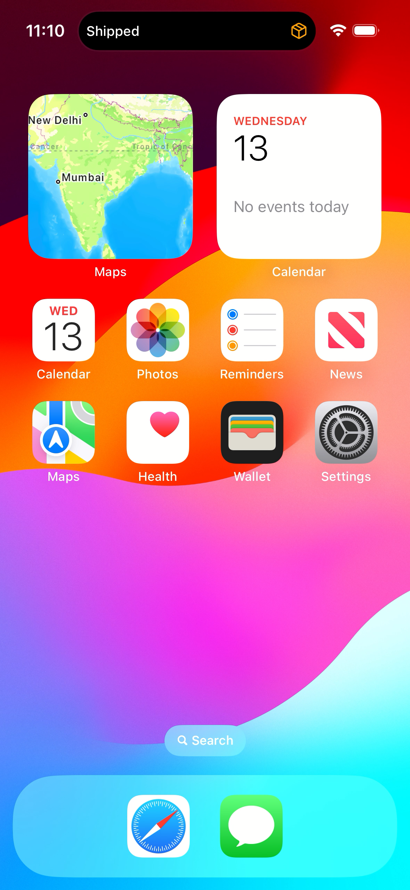
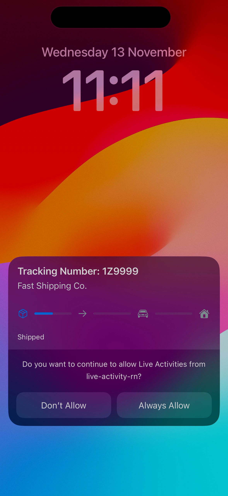
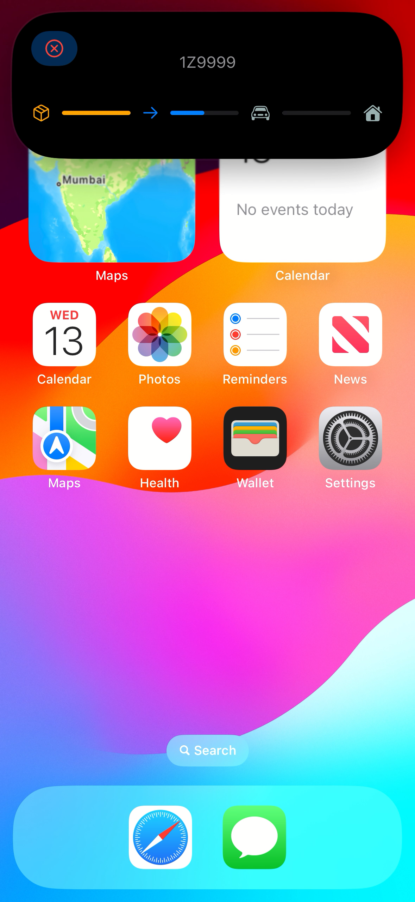
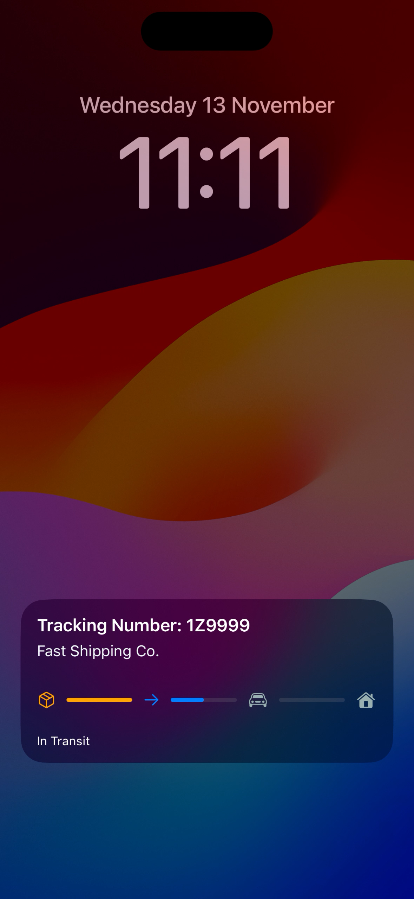
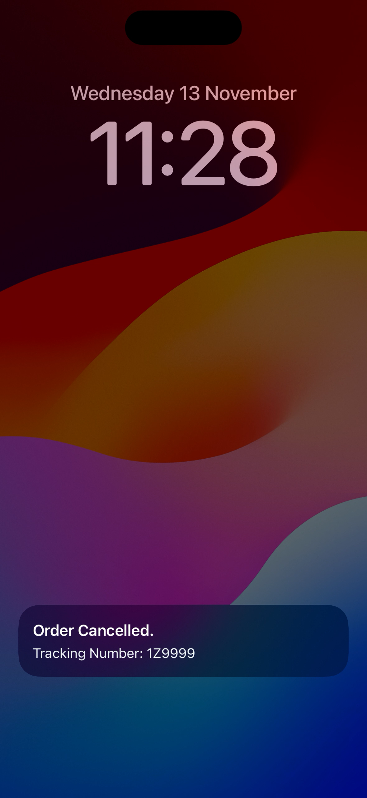

# iOS Live Activity Order Tracking

This project is a sample React Native (Expo) app demonstrating the use of Live Activities for tracking the status of an order. Built [expo-apple-targets](https://github.com/EvanBacon/expo-apple-targets) integrated with a React Native project through a [Expo modules](https://docs.expo.dev/modules/overview/), it showcases order status updates directly on the Lock Screen and within the Dynamic Island (for iPhone models that support it). The app includes a Live Activity widget that displays order progress and provides options for user interaction, such as cancelling an order.

## Table of Contents
- [iOS Live Activity Order Tracking](#ios-live-activity-order-tracking)
  - [Table of Contents](#table-of-contents)
  - [Features](#features)
  - [Installation and Usage](#installation-and-usage)
  - [Usage](#usage)
  - [Project Structure](#project-structure)
    - [Live Activity Widget Target](#live-activity-widget-target)
    - [Native Module to control LiveActivity](#native-module-to-control-liveactivity)
  - [Demo](#demo)


## Features
- **Order Tracking with Live Activity**: View updates on order status, such as *Shipped*, *In Transit*, *Out for Delivery*, and *Delivered*.
- **Dynamic Island Integration**: For supported devices, the Live Activity is visible in the Dynamic Island, providing at-a-glance tracking and quick actions.
- **User Interaction with Live ActivityIntent**: Allows users to cancel an order directly from the widget, triggering updates within the React Native app.
- **expo-apple-targets Integration**: Expo Config Plugin that generates native Apple Targets like *Widgets* or *App Clips*, and links them outside the `/ios` directory


## Installation and Usage
1. **Clone the repository**:
   ```bash
   git clone https://github.com/akshayjadhav4/live-activity-rn-demo.git
   cd live-activity-rn
   ```

2. **Install CocoaPods dependencies**:
   ```bash
   npm install
   ```
3. **Generate iOS project**:
   ```bash
   npx expo prebuild --platform ios --no-install
   ```

## Usage
1. **Run the App**:
   ```bash
   npm run ios
   ```
2. **Trigger the Live Activity**:
   - Once App is open press `Start` which will start actvity.
3. **Interacting with the Activity**:
   - **LiveActivityIntent** runs the in the app’s process so custom app intent need to be added to app target.
   - Struct extending `LiveActivityIntent` put inside `_shared` folder. Plugin will add this file in Main app target as well. 
4. **Testing**:
     - View the activity in the Lock Screen or Dynamic Island on supported devices.
     - In expanded Dynamic Island view use the *Cancel Order* button to test the `LiveActivityIntent` functionality.


## Project Structure

### Live Activity Widget Target

```bash
.
└── widgets
    ├── Assets.xcassets  # assets will be linked as resources of the target
    ├── Attributes.swift # describe data that Live Activity displays (ActivityAttributes)
    ├── _shared
        ├── OrderTrackingLiveActivityIntent.swift # LiveActivityIntent handling
    ├── Info.plist
    ├── OrderTrackingActivity.swift # LiveActivity widget code and UI setup
    ├── PrivacyInfo.xcprivacy
    ├── expo-target.config.json # config to generate LiveActivity Widget
    └── index.swift # Main widget

```

### Native Module to control LiveActivity

```bash
.
└── order-tracking
    ├── android
    ├── expo-module.config.json
    ├── index.ts # expose JavaScript functions to control LiveActivity 
    ├── ios
    │   ├── Attributes.swift # copy of ActivityAttributes same as target
    │   ├── OrderTracking.podspec
    │   ├── OrderTrackingModule.swift # iOS implementation to manage LiveActivity
    │   └── OrderTrackingView.swift 
    └── src
        ├── OrderTracking.types.ts # TypeScript types and interfaces for the module 
        ├── OrderTrackingModule.ios.ts # Exposes the native module to the JavaScript side
        └── OrderTrackingModule.ts # placeholder implementation of native module for other platforms
```

## Demo

<div style="display: flex; justify-content: center; gap: 10px;">
  
  
</div>

<div style="display: flex; justify-content: center; gap: 10px; margin-top:10px">
  
  
</div>

<div style="display: flex; justify-content: center; gap: 10px; margin-top:10px">
  
  
</div>